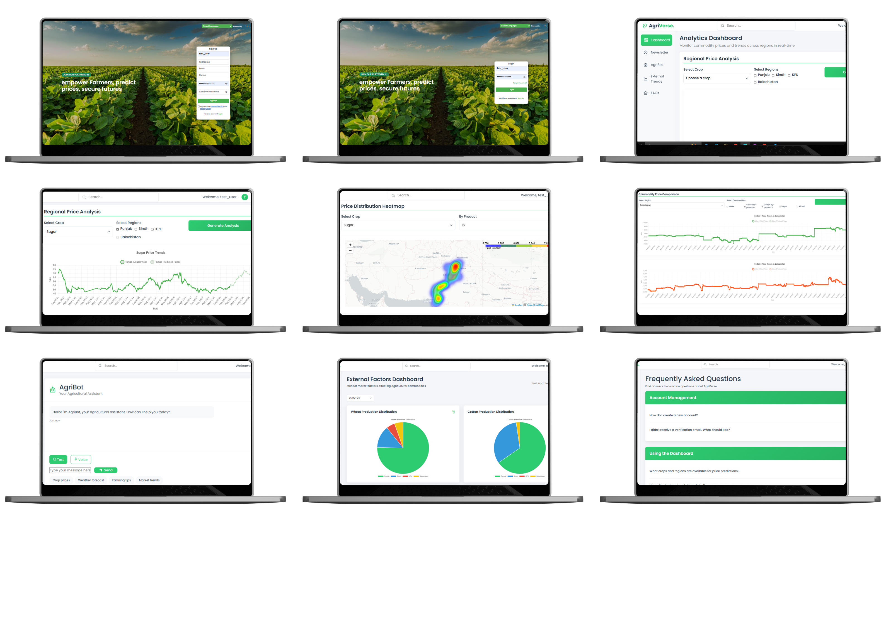
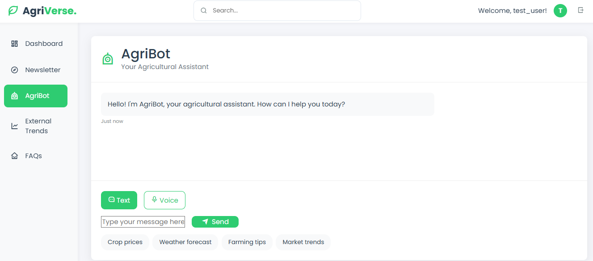
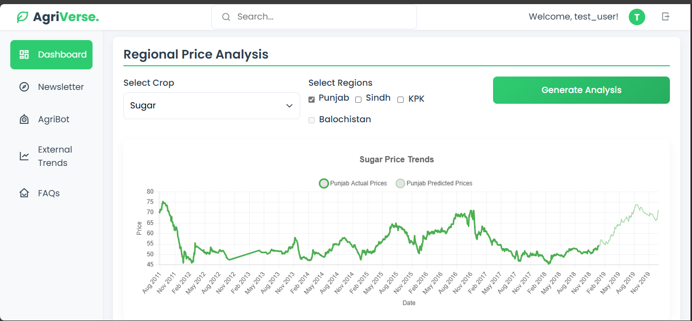
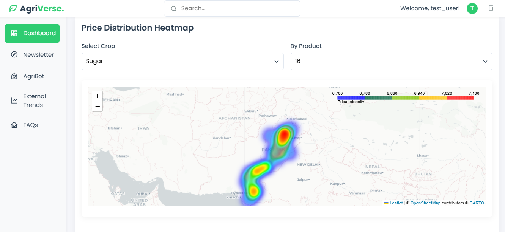

# AgriVerse

> A production-oriented agricultural intelligence platform for Pakistan — multi-crop price forecasting, a multilingual dashboard, and a database-grounded conversational assistant. Built in collaboration with Pakistan Agricultural Research.


## Overview

Pakistan's agricultural markets run on delayed, fragmented price signals, so farmers and traders often sell on incomplete information. AgriVerse turns a noisy, high-stakes data environment into a usable end-to-end system, combining three components into one platform:

- **Multi-source time-series forecasting** of crop prices
- **A multilingual web dashboard** for exploring historical and predicted prices
- **A conversational interface** that answers natural-language questions directly from the project database

The hard part wasn't any single model — it was making data ingestion, experimentation, forecasting, visualization, and natural-language access function as one coherent pipeline.

## Demo



**AgriBot — the LLM crop advisor (text or voice)**



**Regional price analysis — actual vs. predicted prices**



**Price distribution heatmap across stations**



## What it does

- **Forecasts** district- and station-level prices for major crops — wheat, maize, cotton, and sugar (plus related by-products) — across **200 locations**, using market and agricultural data from **2004–2025**.
- **Speaks the user's language** — Urdu, Sindhi, Punjabi, Balochi, and Pashto, via both text and voice, so the tool reaches non-technical and low-literacy users.
- **Answers questions in plain language** — ask about a crop, region, or trend and get a response grounded in the actual database, not free-form text.
- **Visualizes the market** — interactive dashboard with historical and predicted price trends and a geographic price heatmap, filterable by region and crop.

## How it works

**Data pipeline.** Historical commodity prices are fused with weather signals, macroeconomic indicators, and exchange-rate data. The pipeline handles missing values, sparse station coverage, and outliers, and engineers lag features, rolling statistics, and cyclical encodings, with feature selection to keep the forecasting setup robust under real-world conditions.

**Forecasting.** Statistical baselines (ARIMA/SARIMA, Prophet) were benchmarked against Random Forest, gradient boosting, LSTM, and transformer models. Time windows, lag lengths, dropout, and other hyperparameters were tuned through repeated validation and comparison.

**Conversational assistant.** AgriBot uses **Llama 4 Maverick (via Groq)** to translate a natural-language question into a SQL query over the project database. It retrieves the matching rows as grounded context and uses them to explain trends and answer from real system data rather than generating unsupported text. **Whisper**-based speech-to-text enables voice input.

**Serving.** A **Flask** backend exposes REST APIs for price retrieval, filtering, forecasting, and chat. Structured data lives in **PostgreSQL on Supabase** (accessed via the Supabase client / psycopg2). The dashboard renders interactive maps (Leaflet/folium) and price charts.

## Results

| Model | Accuracy | MAE |
| --- | --- | --- |
| Transformer | **90%** | **3.2** |
| LSTM | 88% | 3.5 |
| Random Forest / boosting | outperformed statistical baselines | — |

- Incorporating external features (weather, macroeconomic, exchange-rate) improved performance by **3–5%**.
- Tree-based and boosting methods beat classical statistical baselines; deep models (LSTM, transformers) led overall.

## Why it stands out

Most agricultural forecasting work is single-crop, single-region, or never deployed. AgriVerse integrates **multi-commodity forecasting, district-level granularity, multilingual access, and a database-grounded conversational interface** into a single, deployed system tailored for Pakistan — a real-world decision-support tool rather than an isolated prototype.

## Tech stack

Python · pandas / NumPy · scikit-learn · ARIMA/SARIMA · Prophet · Random Forest / XGBoost · LSTM & transformer forecasting · Flask · REST APIs · PostgreSQL (Supabase) · Groq API (Llama 4 Maverick) · Whisper · folium / Leaflet

## Running it

```bash
git clone https://github.com/oa07610/AgriVerse.git
cd AgriVerse
pip install -r requirements.txt
cp .env.example .env   # add your Supabase, Groq, and other keys here — never commit the real .env
python app.py          # or: gunicorn app:app
```

## Notes

Final-year project, developed with Pakistan Agricultural Research. Reported metrics are from the project's forecasting experiments. MIT licensed.
